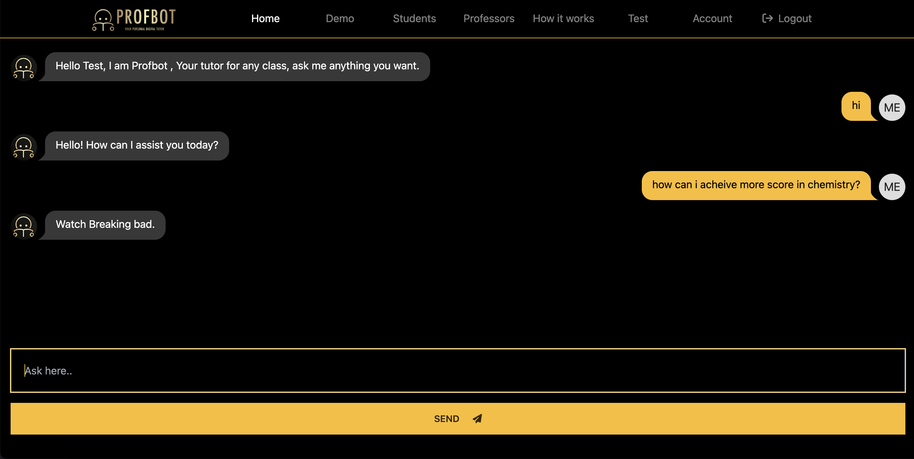

# ProfBot

Everything you need to start profbot
[`Live Demo`](https://professorbot.netlify.app).



## Creating a project

If you're seeing this, you've probably already done this step. Congrats!

>You can get a postgresql database using Supabase or any other database service like amazon rds etc

### To Install the app locally

```bash
# Clone the repo and then first install prisma
npm install prisma --save-dev

npm install
# Initialize the database after you changed the url 
# this step is important and make 
npx prisma db push
```

## Developing

Once you've created a project and installed dependencies with `npm install` start a development server:

```bash
npm run dev

# or start the server and open the app in a new browser tab
npm run dev -- --open
```

## Building

To create a production version of your app:

```bash
npm run build
```

#### Also make sure to copy correct enviroment(as mentioned in .env.example) variables to your hosting provider 

You can preview the production build with `npm run preview`.
####After you connected your database run the following command
```bash
npx prisma db seed
```

> To deploy your site to the web you need to host it with given settings and first initialize the database and then run it

A website where a admin can create and view test with a human like interaction between user and bot

##### Cool 😎
##### Modern 🦾
##### Simple 😇😇